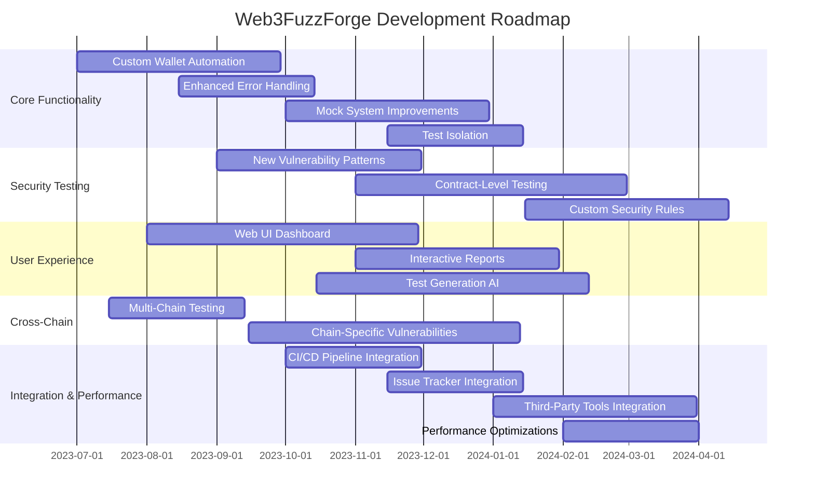
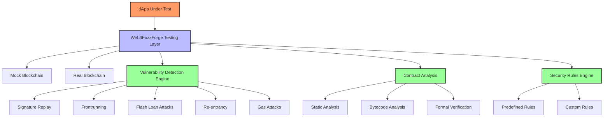
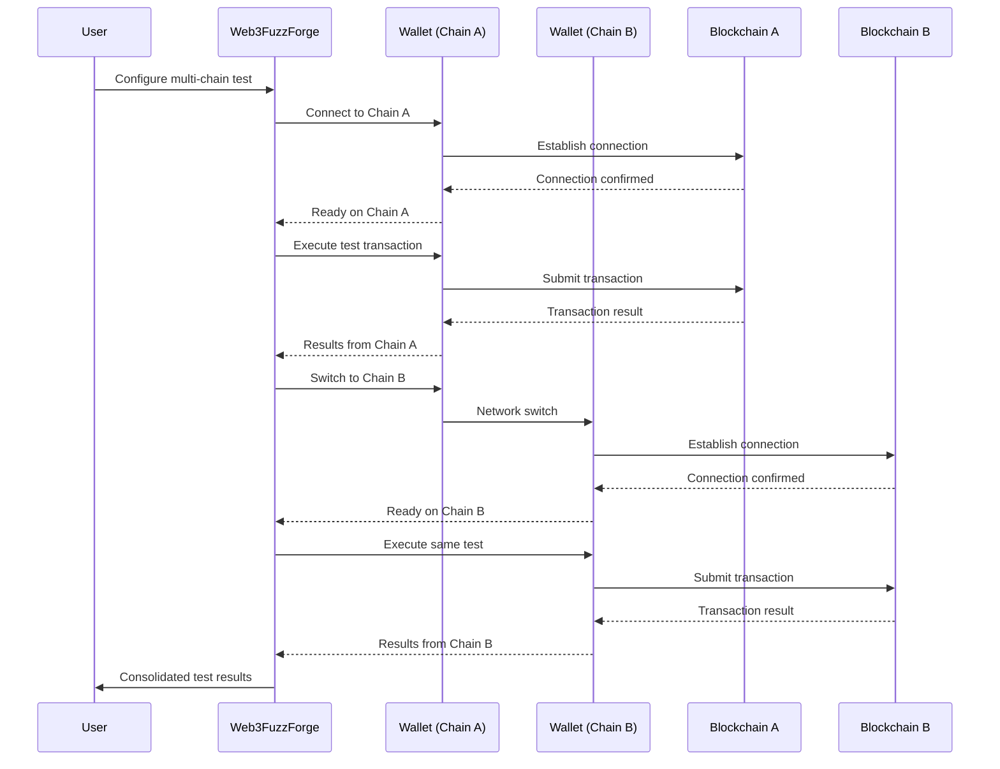
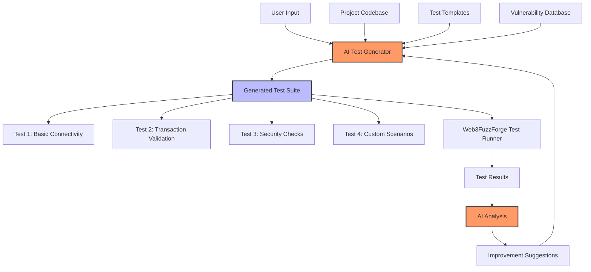
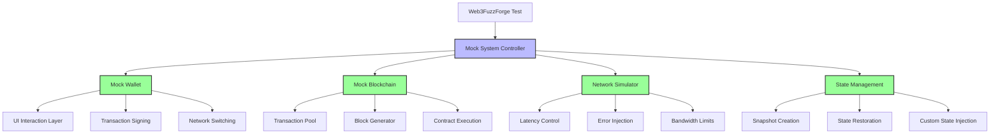
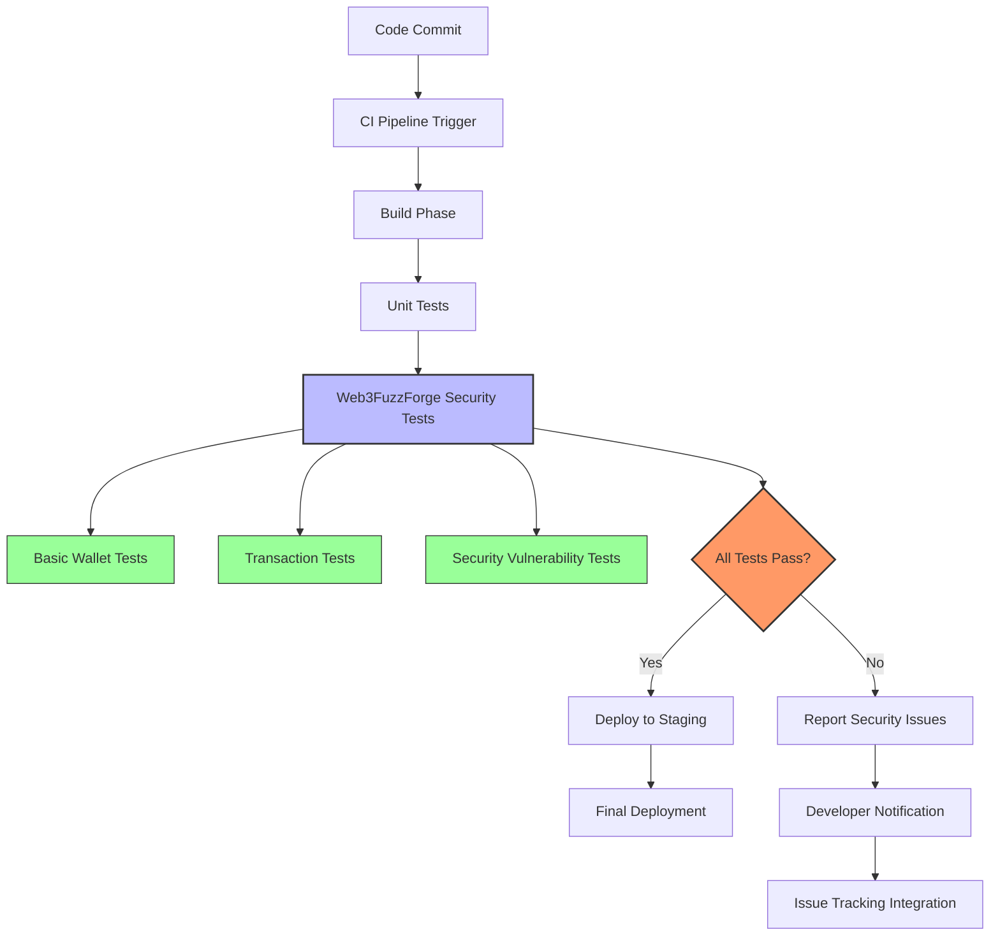

# Visual Guide to Future Improvements

This document provides visual representations of the planned improvements for Web3FuzzForge.

## Improvement Areas Overview

```mermaid
graph TD
    A[Web3FuzzForge Enhancements] --> B[Core Functionality]
    A --> C[Security Testing]
    A --> D[User Experience]
    A --> E[Cross-Chain Support]
    A --> F[Integration]
    A --> G[Performance]
    
    B --> B1[Error Handling]
    B --> B2[Mock System]
    B --> B3[Test Isolation]
    B --> B4[Documentation]
    
    C --> C1[Vulnerability Patterns]
    C --> C2[Contract-Level Testing]
    C --> C3[Custom Security Rules]
    
    D --> D1[Web UI Dashboard]
    D --> D2[Interactive Reports]
    D --> D3[Test Generation AI]
    
    E --> E1[Multi-Chain Testing]
    E --> E2[Chain-Specific Vulnerabilities]
    
    F --> F1[CI/CD Integration]
    F --> F2[Issue Tracker]
    F --> F3[Third-Party Tools]
    
    G --> G1[Test Speed]
    G --> G2[Parallel Testing]
    
    style A fill:#f9f,stroke:#333,stroke-width:2px
    style B fill:#bbf,stroke:#333,stroke-width:1px
    style C fill:#bbf,stroke:#333,stroke-width:1px
    style D fill:#bbf,stroke:#333,stroke-width:1px
    style E fill:#bbf,stroke:#333,stroke-width:1px
    style F fill:#bbf,stroke:#333,stroke-width:1px
    style G fill:#bbf,stroke:#333,stroke-width:1px
```



## Timeline



## Enhanced Security Testing Architecture



## Web UI Dashboard Concept

```
+-------------------------------------------------------+
|  Web3FuzzForge Dashboard                       🔔 ⚙️  |
+-------------------------------------------------------+
|                                                       |
| Test Execution Status                                 |
| [========================================] 75%        |
|                                                       |
| +-------------------+  +----------------------+       |
| | Security Tests    |  | Recent Vulnerabilities |     |
| | ✅ Connection     |  | ⚠️ Unlimited Approval |     |
| | ✅ Basic Txns     |  | ⚠️ Missing Input Val  |     |
| | ❌ Approval Tests |  | ❌ Re-entrancy Risk   |     |
| | ⚠️ Sign Messages |  | ✅ No Front-Running   |     |
| +-------------------+  +----------------------+       |
|                                                       |
| +-------------------+  +----------------------+       |
| | Resource Monitor  |  | Test History         |      |
| | CPU: 45%          |  | [Graph showing test  |      |
| | RAM: 1.2GB/4GB    |  |  results over time]  |      |
| | Network: 3.5MB/s  |  |                      |      |
| +-------------------+  +----------------------+       |
|                                                       |
| Security Score: 78/100  ⬆️ +5 from last run           |
|                                                       |
+-------------------------------------------------------+
```

## Cross-Chain Testing Workflow



## AI-Assisted Test Generation



## Mock System Architecture



## CI/CD Integration Workflow

